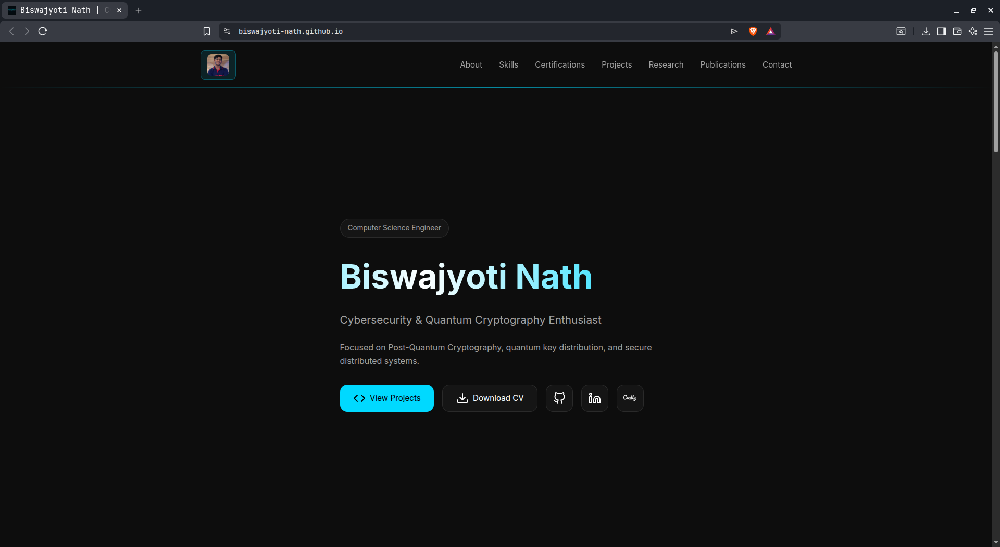

# **Personal Portfolio — Biswajyoti Nath**

Modern, minimal, neon-accented portfolio built with HTML, CSS, and JavaScript.
Showcases my work across **systems**, **security**, **software engineering**, and **research-aware projects**.

---

## 🌐 **Live Portfolio**

**Live Site:** [https://biswajyoti-nath.github.io/](https://biswajyoti-nath.github.io/)

---

## 🚀 **Overview**

This portfolio highlights my work and interests across:

* Systems & low-level fundamentals
* Cybersecurity and practical tooling
* Modern web engineering
* Research-aware topics (e.g., quantum-secure ideas — not the sole focus)

Designed to be **clean, fast, and distraction-free**, featuring:

* Light/Dark theme toggle (saved with `localStorage`)
* Smooth scroll-reveal animations
* Fast and subtle hero typing effect
* Clean neon accents (no blur)
* GitHub + LinkedIn icons in navbar
* Fully responsive layout

---

## 🎨 **Tech Stack**

### **Frontend**

* HTML5
* CSS3 (custom, minimal, responsive)
* Vanilla JavaScript

### **Features**

* Persistent theme toggle
* Scroll reveal animations
* Typing animation
* Mobile-first layout
* SVG icons for crisp UI

---

## 🧩 **Structure**

```
/css
   style.css        # Minimal, neon-accented stylesheet

/js
   main.js          # Typing animation, theme toggle, reveal logic

index.html          # Core site structure
assets/             # Images, icons, favicons
```

---

## 📌 **Projects Displayed in the Portfolio**

### **1. ATC_Project**

Prototype ML pipeline using **YOLOv8**, **OpenCV**, and **Flask** for segmentation, feature extraction, and automated scoring.
Practical tooling built for a competitive evaluation setup.

Repo: [https://github.com/biswajyoti-nath/ATC_Project](https://github.com/biswajyoti-nath/ATC_Project)

---

### **2. BVEC CSE 24–28 Portal**

Frontend-first portal for the CSE 2024–28 cohort.
Includes birthday tracking, shared resources, and a clean UI.

Live: [https://biswajyoti-nath.github.io/cse24-28/](https://biswajyoti-nath.github.io/cse24-28/)
Repo: [https://github.com/biswajyoti-nath/bvec-cse-24-28-portal](https://github.com/biswajyoti-nath/bvec-cse-24-28-portal)

---

### **3. Randomness in Quantum Cryptography**

Analytical report comparing **QRNGs vs PRNGs**, device-independent randomness, and reproducible experiments.

Repo: [https://github.com/biswajyoti-nath/randomness-in-quantum-cryptography](https://github.com/biswajyoti-nath/randomness-in-quantum-cryptography)

---

## 🤝 **Community & Leadership**

### **Rotary Club — Volunteer**

* Assisted in planning and running **two Heart Awareness Camps**.
* Coordinated with medical staff and participants for smooth event flow.
* Demonstrated reliability, responsibility, and professionalism in real-world settings.

### **Teaching Outreach — Remote Vencher School**

* Conducted a **full-day STEM teaching session** for rural students.
* Adapted explanations to low-resource environments.
* Strengthened communication, teaching, and leadership skills.

---

## 📸 **Preview**





---

## 🎯 **Why I Built This**

To create a fast, distraction-free personal website that reflects my work across systems, security, and practical engineering — while acknowledging ongoing interest in research-driven topics like quantum-safe approaches.

---

## 🔗 **Connect with Me**

**GitHub:** [https://github.com/biswajyoti-nath](https://github.com/biswajyoti-nath)
**LinkedIn:** [https://linkedin.com/in/biswajyoti-nath-984404323](https://linkedin.com/in/biswajyoti-nath-984404323)

---

## 📄 **License**

This project is open-source under the **MIT License**.
You are free to reference or adapt any part of the layout, animations, or components.

---

If you want, I can also generate:

* A **shorter “About” version** for GitHub
* A **compressed README** for LinkedIn
* A **banner image** for the preview section (neon, clean, matches your theme)

Just tell me.
