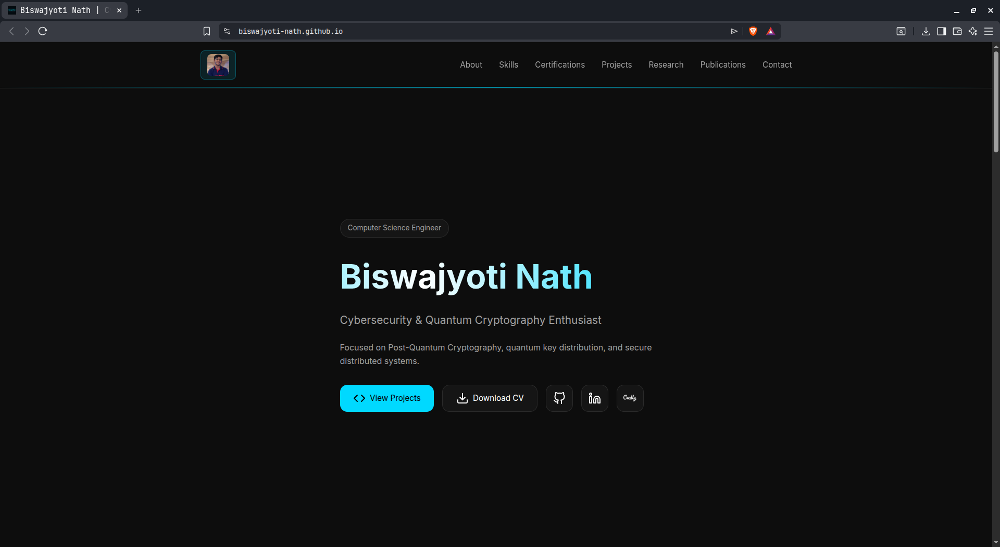

<h1 align="center">⚡ Biswajyoti Nath — Portfolio Website</h1>

<p align="center">
Personal portfolio website showcasing projects, research interests, certifications, and publications.
</p>

<p align="center">


</p>
<p align="center">
  
</p>

---

## 🌐 Live Website

https://biswajyoti-nath.github.io/

---

## 🚀 About

This repository contains the source code for my personal portfolio website.

The site acts as a central hub for my academic work and technical projects. It presents my work in cybersecurity, machine learning, and quantum cryptography through a clean and responsive interface.

The portfolio highlights:

* 🔐 Cybersecurity interests
* ⚛️ Quantum cryptography research
* 🧠 Machine learning work
* 💻 Software projects
* 🏅 Certifications and credentials
* 📄 Publications and research writing

---

## ✨ Features

* 📱 Fully responsive design
* 🎨 Modern dark UI
* ⚡ Smooth scrolling navigation
* 🧭 Active navigation highlighting
* 🏅 Certification badge display
* 💻 Project showcase
* 📄 Publication section with DOI references
* 🔗 Links to GitHub, LinkedIn, and Credly

---

## 🛠 Tech Stack

Frontend

* HTML5
* CSS3
* Vanilla JavaScript

Libraries

* Feather Icons
* Lenis (smooth scrolling)

Hosting

* GitHub Pages

---

## 📂 Project Structure

```id="s5v1zw"
portfolio/
│
├── index.html
├── css/
│   └── style.css
├── js/
│   └── main.js
├── image/
│   ├── live.png
│   ├── profile.jpeg
│   └── certification badges
└── README.md
```

---

## 💻 Running Locally

Clone the repository

```id="92fc0e"
git clone https://github.com/biswajyoti-nath/biswajyoti-nath.github.io.git
```

Then open the website locally:

```id="1e1gb2"
index.html
```

You may also run the project using a local development server.

---

## 👨‍💻 Author

**Biswajyoti Nath**

Computer Science Engineering Student

Research interests:

* Cybersecurity
* Post-Quantum Cryptography
* Secure Systems
* Machine Learning

GitHub
https://github.com/biswajyoti-nath

LinkedIn
https://linkedin.com/in/biswajyoti-nath-984404323

---

## 📜 License

This repository contains the source code for my personal portfolio website.

The code is provided for viewing and educational purposes only.
Reuse, redistribution, or modification without permission is not allowed.
